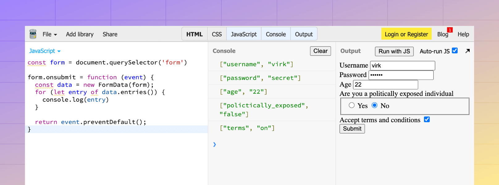

# HTML forms and surprises

HTML forms have particular serializing behavior attached to them that you need to understand and address to work with normalized data in your applications.

In this guide, we will learn how you can use the VineJS APIs to normalize the data at the time of validating it.

## Empty fields lead to empty strings

The backend receives an empty string when you submit an HTML form with a blank field. At some stage, you must convert these empty strings to `null` to keep your database state normalized. For example:

- You have a user profile page with an optional dropdown for country selection.
- Since selecting a country is optional, you may have marked the `country` column inside the database as `nullable`.
- During profile update, the backend will receive an empty string if the user does not select a country.
- However, you should convert this empty string value to `null`. Otherwise, your database will have un-normalized data with empty string values.

With VineJS, you can perform this normalization globally using the `convertEmptyStringsToNull` flag.

```ts
import vine from '@vinejs/vine'

vine.convertEmptyStringsToNull = true
```

Continuing with the previous example, you may define the `country` field schema as follows.

```ts
const schema = vine.object({
  country: vine.string().nullable()
})

const data = {
  country: ''
}

const validator = vine.compile(schema)
const output = await validator.validate(data)
// { country: null }
```

## Number input results in a string value

The value of the `<input type="number">` field is not a number but a string. This is because there are no data types in HTML forms, and the values are always strings.

Therefore, you will have to normalize the HTML form fields and work with specific data types at some stage. 

VineJS performs this normalization alongside validations. For example, the `string.number` type will attempt to convert the string-based numeric values to a JavaScript number data type before performing additional validations.

```ts
const schema = vine.object({
  age: vine.number().min(18)
})

const data = {
  age: '32'
}

const validator = vine.compile(schema)
const output = await validator.validate(data)
// { age: 32 }
```

The same holds true for boolean values as well. The `true` and `false` values for the input fields will result in a string representation of a boolean. However, the `vine.boolean` schema type can handle the normalization for you.

## Checkboxes are not Booleans

Checkboxes are the notorious ones. If you do not check a checkbox, it will be removed from the data object, and selecting a checkbox will result in a string value `"on"`.

In VineJS, we have a dedicated schema type called `schema.accepted`, which ensures the field is present and must have one of the following values.

- `"on"`
- `"1"`
- `"yes"`
- `"true"`

If validation passes, the value will be normalized to `true`.

```ts
const schema = vine.object({
  terms: vine.accepted()
})

const data = {
  terms: 'on'
}

const validator = vine.compile(schema)
const output = await validator.validate(data)
// { terms: true }
```

## Everything together

Here's a demo showcasing serialized form data of what we have covered so far. https://jsbin.com/detixawaxa/edit?html,js,console,output


