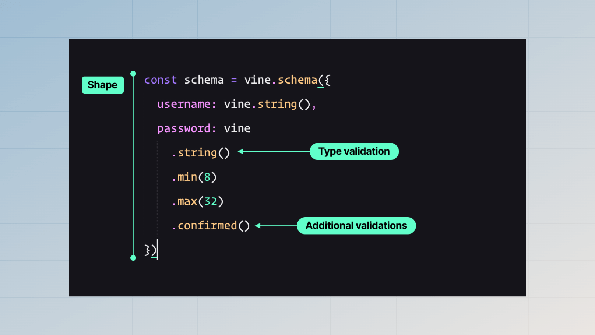

# Schema 101

The validation schema defines the shape and the format of the data you expect during validation. We have divided the validation schema into three parts, i.e.

- **The shape of the data** is defined using the `vine.schema` method.
- **The data type for fields** is defined using the schema methods like `vine.string`, `vine.boolean`, and so on.
- **Additional validations and mutations** are applied using the rules available on a given schema type.



## Creating schemas

The validation schema is created using the `vine.schema` method. The method accepts a key-value pair, where the key is the field name, and the value is another schema type.


:::note

The `vine.schema` is a superset of the `vine.object`  schema type. It defines a top-level object and exposes additional methods like [`toCamelCase`](#converting-the-output-to-camelcase).

:::

```ts
const schema = vine.schema({
  username: vine.string()
})
```

## Re-using and composing schemas
The API for re-using schema types to compose new schemas is **intentionally underpowered in VineJS**. 

We believe, [writing some duplicate code](https://overreacted.io/the-wet-codebase/) to produce simple code can be beneficial over using complex APIs to split, extend, pick, and omit properties that are harder to reason about. You might hold different views, but this is how we want to build and maintain VineJS.

### Cloning schema types
VineJS schema APIs mutate the same underlying object. Therefore, you may call the `clone` method on a schema type to create a fresh instance of the same type and configure it separately. For example:

```ts
const userSchema = vine.object({
  username: vine.string()
})

const postSchema = vine.object({
  title: vine.string(),
  // highlight-start
  author: userSchema.clone().nullable()
  // highlight-end
})
```

### Extending object properties
You may call the `extend` method on an object schema type to add additional properties to an existing object. The `extend` method performs a shallow merge.

```ts
const userSchema = vine.object({
  username: vine.string()
})

const postSchema = vine.object({
  title: vine.string(),
  // highlight-start
  author: userSchema
    .clone()
    .extend({ id: vine.number() })
  // highlight-end
})
```

### Creating root schema from an object schema
You may pass the `vine.object` output to the `vine.schema` method. It is usually helpful when you already have an object schema type and want to construct a root schema.

```ts
const userSchema = vine.object({
  username: vine.string()
})

const postSchema = vine.object({
  title: vine.string(),
  author: userSchema.clone()
})

// highlight-start
vine.schema(userSchema)
vine.schema(postSchema)
// highlight-start
```

## Nullable and optional modifiers

See also: [HTML forms and surprises](./html_forms_and_surprises.md)

Throughout the documentation, you will find examples using the `nullable` or `optional` modifiers. These modifiers are used to mark fields as optional or null.

### Optional modifier

All the fields are required by default, and you may mark them as optional using the optional modifier. 

- An optional field may contain an `undefined` or `null` value.
- The field is removed from the output when it is `undefined` or `null`.

```ts
{
  name: vine.string().optional()
}

// input=foo; output=foo
// input=null; output=undefined
// input=undefined; output=undefined
```

### Nullable modifier
The nullable modifier expects the field under validation to exist, but its value can be `null`. Also, the field is always present in the output.

```ts
{
  name: vine.string().nullable()
}

// input=foo; output=foo
// input=null; output=null
// input=undefined; throws exception
```

### Using both the modifiers together

You end up with the following behavior when you use the `optional` and the `nullable` modifiers together.

- Both `null` and `undefined` values will be allowed.
- If the value is `null`, it will be written to the output.
- If the value is `undefined`, it will be removed from the output.

```ts
{
  name: vine.string().nullable().optional()
}

// input=foo; output=foo
// input=null; output=null
// input=undefined; output=undefined
```

## Schema types

Following is the list of available schema types supported by VineJS. We also support extending the schema API by [creating custom types](../extend/custom_schema_types.md).

- [String](../types/string.md)
- [Boolean](../types/boolean.md)
- [Number](../types/number.md)
- [Union](../types/union.md) (for expressing conditonals)
- [Array](../types/array.md)
- [Tuple](../types/tuple.md)
- [Object](../types/object.md)
- [Record](../types/record.md)
- [Enum](../types/enum.md)
- [Accepted](../types/accepted.md)
- [Any](../types/any.md)
- [Literal](../types/literal.md)
- [Date](../types/date.md) (via Luxon package)

## Using functions as validation rules

You are not only limited to validation rules available via the schema API. You can also convert plain JavaScript functions to validation rules and use them with any schema type.

In the following example, we create a validation rule using the `vine.createRule` method and apply it to fields using the `schema.use` method.

See also: [Creating custom rules](../extend/custom_rules.md)

```ts
import vine from '@vinejs/vine'

const myRule = vine.createRule(async (value, options, ctx) => {
  // Implementation goes here
})

const schema = vine.schema({
  username: vine.string().use(
    myRule()
  ),
  email: vine.string().email().use(
    myRule()
  )
})
```

## Bail mode

VineJS stops the validation chain when any validation fails for a given field. We call this behavior the `bail` mode.

In the following example, if the field's value is not a `string`, VineJS will not perform the `email` and the `unique` validations. This is the behavior you would want most of the time.

```ts
const schema = vine.schema({
  email: vine.string().email().use(
    unique({ table: 'users', column: 'email' })
  )
})
```

However, you may turn off the `bail` mode for a given field using the `bail` method (if needed).

```ts
const schema = vine.schema({
  email: vine.string().email().use(
    unique({ table: 'users', column: 'email' })
  )
  // highlight-start
  .bail(false)
  // highlight-end
})
```

## Parsing input value

You may use the `parse` method on all the schema types to mutate the input value before the validation cycle begins. Since the `parse` method is called before the validation cycle, the field's value is unknown, and you must handle all the edge cases to avoid runtime exceptions.

The `parse` method receives the `value` as the first argument and the [field context](./field_context.md) as the second argument.

```ts
function assignDefaultRole(value: unknown) {
  if (!value) {
    return 'guest'
  }
  
  return value
}

const schema = vine.schema({
  role: vine.string().parse(assignDefaultRole)
})
```

## Transforming output value

You may use the `transform` method on available schema types to mutate the output value. The `transform` method is not called in the following cases.

- When the field is invalid (it has failed one or more validations).
- When the field value is `undefined`.
- The `transform` method is not available for `array`, `object,` `record`, and `tuple` schema types. This is an intentional limitation, and we may re-consider it if there are enough valid use cases.

The `transform` method receives the `value` as the first argument and the [field context](./field_context.md) as the second argument. You may return a completely different data type from the `transform` method.

```ts
const schema = vine.schema({
  amount: vine.number().decimal([2, 4]).transform((value) => {
    return new Amount(value)
  })
})
```

## Converting the output to camelCase

VineJS allows you to transform all field names to `camelCase` using the `toCamelCase` method. The helper is added since the HTML input names are usually in `snake_case`, but we JavaScript developers define variables in `camelCase`.

:::note

Applying the `toCamelCase` transformation at runtime is relatively simple. However, converting the types simultaneously takes a lot of work. Therefore, we will not add more transforms like `toConstantCase` or `toUpperCase`. 

:::

:::codegroup

```ts
// title: Without camelCase helper
const schema = vine.schema({
  first_name: vine.string(),
  last_name: vine.string(),
  referral_code: vine.string().optional()
})

const validate = vine.compile(schema)

const {
 first_name,
 last_name,
 referral_code
} = await validate({ data })
```

```ts
// title: With camelCase helper
const schema = vine.schema({
  first_name: vine.string(),
  last_name: vine.string(),
  referral_code: vine.string().optional()
})
// insert-start
.toCamelCase()
// insert-end

const validate = vine.compile(schema)

const {
 // delete-start
 first_name,
 last_name,
 referral_code
 // delete-end
 // insert-start
 firstName,
 lastName,
 referralCode
 // insert-end
} = await validate({ data })
```

:::
